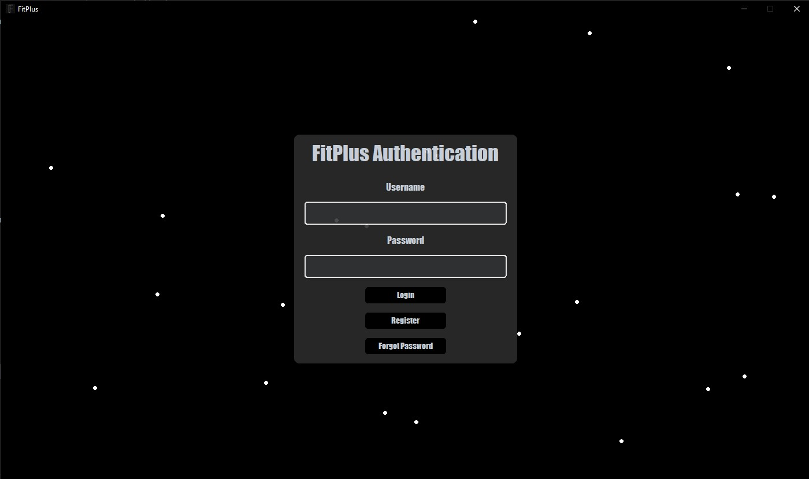
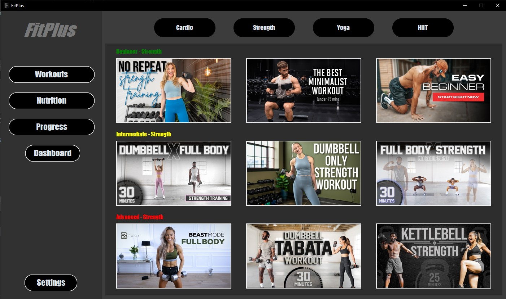
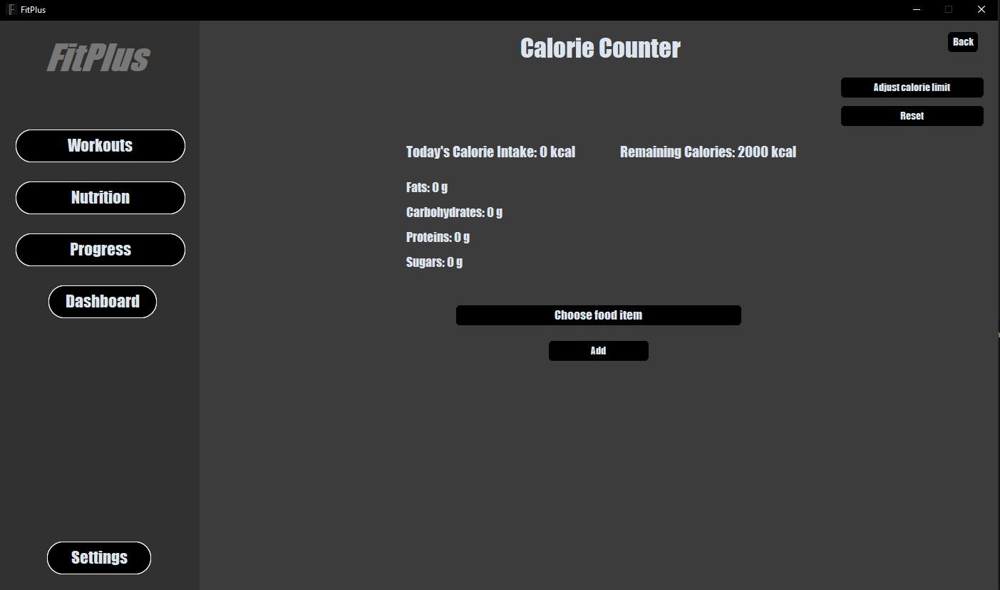
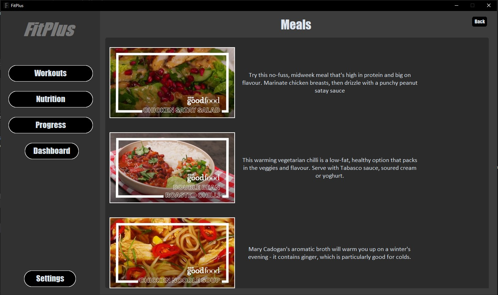
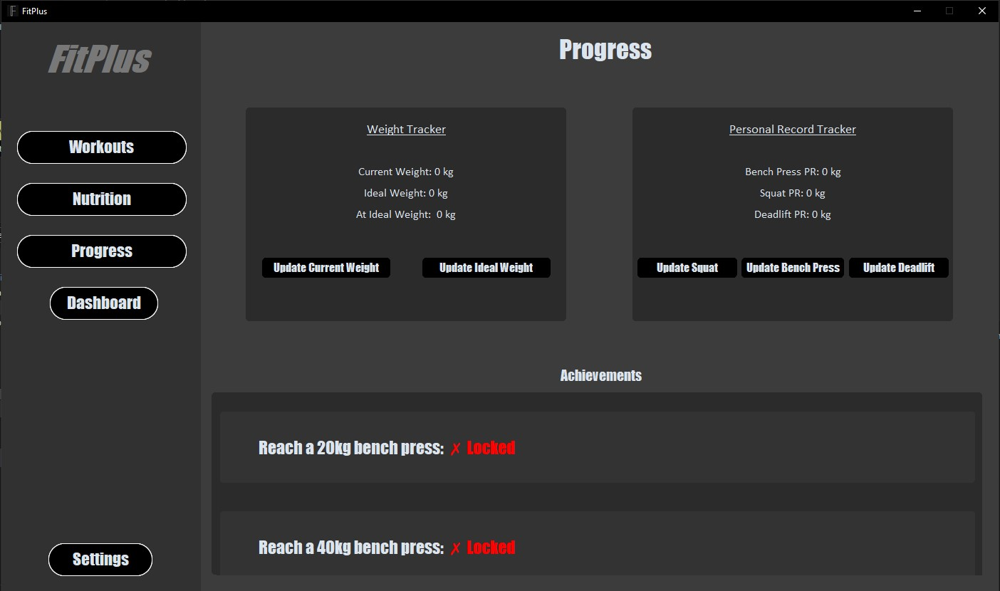

# FitPlus

**FitPlus** is a Python-based fitness tracker app designed to help users manage workouts, meals, and progress efficiently.  
The latest and most complete version is **Version 2**, located inside the `V2/` folder.


---

## Features at a Glance

<table>
<tr>
<td align="center"><br><b>Authentication</b></td>
<td align="center"><br><b>Workout Plans</b></td>
<td align="center"><br><b>Calorie Counter</b></td>
</tr>
<tr>
<td align="center"><br><b>Meal Suggestions</b></td>
<td align="center"><br><b>Progress Tracking</b></td>
<td></td>
</tr>
</table>

---

## 📌 Versions

### 🔹 V2 (Latest)
- Located in the `V2/` folder.
- Enhanced UI using **CustomTkinter**.
- Authentication system (Login, Register, Password Reset).
- Calorie tracker and nutrition analysis.
- Workout plans for multiple categories.
- Progress tracking with weight and PR updates.
- Modular design with reusable components.

To run:

```bash
cd V2
python main.py
```

---

### 🔸 V1 (Legacy)
- Located in the `V1/` folder.
- Prototype or initial version.
- Limited features compared to V2.

To run:

```bash
cd V1
python main.py
```

---

## 🔧 Requirements

- Python 3.10+
- Install external libraries:

```bash
pip install customtkinter CTkMessagebox CTkScrollableDropdown CTkXYFrame Pillow pywinstyles pygame
```

---

---

## 📚 Libraries Used

### Built-in Python Libraries
- `tkinter`, `ttk`, `Label`, `simpledialog` – for GUI components
- `sqlite3` – database management
- `webbrowser` – open URLs in the browser
- `random` – random number generation
- `datetime` – date and time handling
- `os`, `sys`, `pathlib` – file and system operations
- `logging` – logging functionality

### External Libraries
- `customtkinter` – modern themed Tkinter widgets
- `CTkMessagebox` – custom message boxes for Tkinter
- `CTkScrollableDropdown` – scrollable dropdown menus
- `CTkXYFrame` – advanced frame handling for Tkinter
- `Pillow (PIL)` – image processing and handling
- `pywinstyles` – Windows-specific UI enhancements
- `pygame` – sound and multimedia

---

## 📁 Folder Overview

```
Fitplus/
├── V1/                   # Original version
├── V2/                   # Updated version (main)
│   ├── screenshots/      # App screenshots
│   ├── dashboardimgs/
│   ├── mealimages/
│   ├── workoutimgs/
│   └── main.py
├── versionNotes.txt
├── README.md
└── .gitignore
```

---


## 📃 License

This project is licensed under the [MIT License](LICENSE).