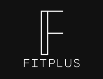

# FitPlus

**FitPlus** is a Python-based fitness tracker app featuring two major releases.  
**Version 2** (inside the `V2/` folder) is the latest and most complete version.



---

## 📌 Versions

### 🔹 V2 (Latest)
- Located in the `V2/` folder.
- Enhanced UI using CustomTkinter.
- Improved layout with modular components.
- Includes sound and icons.
- Uses local SQLite database for tracking.

To run:

```bash
cd V2
python main.py
```

---

### 🔸 V1 (Legacy)
- Located in the `V1/` folder.
- Prototype or initial version.
- May lack some features or polish of V2.

To run:

```bash
cd V1
python main.py
```

---

## 🔧 Requirements

- Python 3.10+
- Install required libraries:

```bash
pip install customtkinter
```

---

## 📁 Folder Overview

```
Fitplus/
├── V1/                   # Original version
├── V2/                   # Updated version (main)
├── versionNotes.txt      # Dev log or changelog
├── README.md             # This file
└── .gitignore
```

---

## 📃 License

This is a personal project. No license currently applied.
